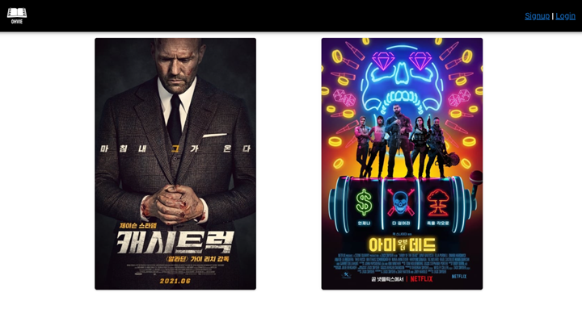
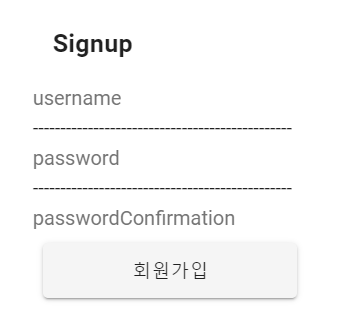
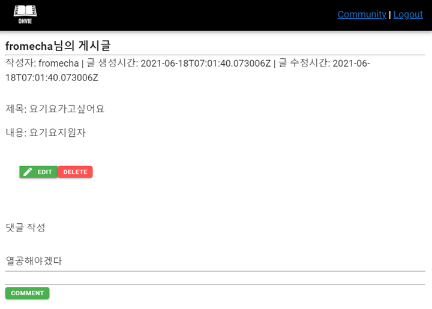

# 1. 팀원 및 업무 분담

- 김동찬: 백엔드 담당(Django, API를 활용한 Data 저장)
- 서예리: 프론트엔드 담당(CSS, Vuetify, vue.js)

# 2. 개발환경

- Python
  - python 3.7.3
  - Django 3.2.3
- DB
  - sqlite3
- JS
  - vue.js

requirements.txt에 있습니다

# 3. 개요

1. 사용 API는 TMDB와 Interpark로 데이터를 수집 및 가공 후 DB에 저장하였습니다
2. 사용자 경험을 위해 vue의 SPA로 구한하였고 git을 통해 협업하였습니다
3. 영화를 선택하면 유사한 영화를 추천받고, 추천받은 영화를 토대로 책을 추천해주는 서비스입니다
4. Django의 view는 cbv와 fbv 중 시간상의 이유와 작은 프로젝트이기 때문에 fbv를 선택했습니다

# 4. 구현 기능

- 조회
  - 영화 개별 조회
  - 댓글 작성 및 수정 / 삭제

- 인증

  - 회원가입

  - 로그인

  - 로그아웃

  - 커뮤니티

    - 게시글 작성

      - 댓글 작성

      

# 5. 느낀점 

- 동찬

함께 협업한다라는 것을 실제로 느낄 수 있는 시간이었습니다

단순한 업무 분담 이상으로 효율적으로 일을 하기 위해서 사이트의 주소, 함수명들을 

명확히 설정하고 가면 중간에 혼선을 방지할 수 있다는 사실에 대해 느낄 수 있었습니다

이번에 Server를 맡아 제작하면서 단순히 server에 데이터를 저장하고 보내주는게 끝이 아니라 Front에서 효율적이고 편하게 받기 위해서 고민을 계속 해야겠다고 생각하게 됬습니다

